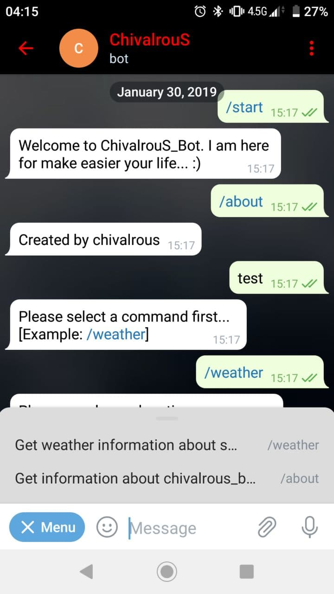
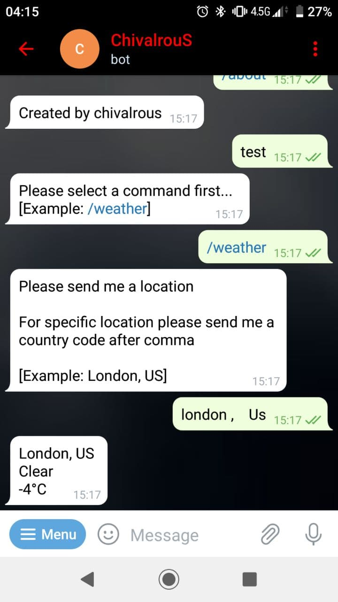

# TelegramBot
### A Telegram bot for some different usage
---

This Telegram Bot gives you the current weather for specific location. 

There is two variables to change in Constants.py file:
* 'TELEGRAM_BOT_TOKEN' which is your Telegram Bot Tokken
* 'WEATHER_API_KEY' which is your Open Weather Map Api Key

I used this two repositories:
* [python-telegram-bot](https://github.com/python-telegram-bot/python-telegram-bot)
* [pyowm](https://github.com/csparpa/pyowm)

---
### Images

